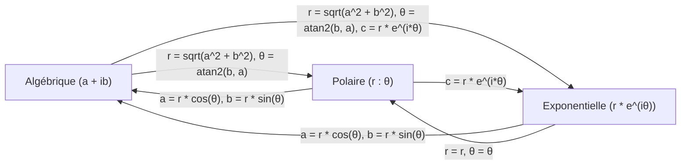

# Projet-compilation

## Représentation des nombres complexes

Un nombre complexe peut être exprimé sous différentes formes : **algébrique**, **polaire** ou **exponentielle**. Voici un récapitulatif des représentations et des formules pour convertir d'une forme à l'autre.

---

### Représentations des nombres complexes

| **Représentation** | **Forme générale**  | **Description**                                                             |
|---------------------|---------------------|-----------------------------------------------------------------------------|
| **Algébrique**      | $c = a + ib$        | $a$ : partie réelle, $b$ : partie imaginaire.                               |
| **Polaire**         | $c = r : \theta$    | $r$ : module, $\theta$ : argument (en radians).                             |
| **Exponentielle**   | $c = r e^{i\theta}$ | Utilise la formule d'Euler : $e^{i\theta} = \cos(\theta) + i\sin(\theta)$.  |

---

### Formules de conversion

| **De $\dots$**                      | **Vers $\dots$**                    | **Formule**                                                                                      |
|-------------------------------------|-------------------------------------|--------------------------------------------------------------------------------------------------|
| **Algébrique ($a + ib$)**           | **Polaire ($r : \theta$)**          | $r = \sqrt{a^2 + b^2}, \theta = \text{atan2}(b, a)$                                              |
| **Algébrique ($a + ib$)**           | **Exponentielle ($r e^{i\theta}$)** | $r = \sqrt{a^2 + b^2}, \theta = \text{atan2}(b, a), c = r e^{i\theta}$                           |
| **Polaire ($r : \theta$)**          | **Algébrique ($a + ib$)**           | $a = r \cos(\theta), b = r \sin(\theta)$                                                        |
| **Polaire ($r : \theta$)**          | **Exponentielle ($r e^{i\theta}$)** | $c = r e^{i\theta}$                                                                              |
| **Exponentielle ($r e^{i\theta}$)** | **Algébrique ($a + ib$)**           | $a = r \cos(\theta), b = r \sin(\theta)$                                                        |
| **Exponentielle ($r e^{i\theta}$)** | **Polaire ($r : \theta$)**          | $r = r, \theta = \theta$ (les deux formes partagent les mêmes valeurs de module et d'argument). |

---

### Exemple : $3.2 + i4.1$

1. **Représentation algébrique** :
   $c = 3.2 + i4.1$

2. **Représentation polaire** :
    - **Module** :
      $r = \sqrt{3.2^2 + 4.1^2} = \sqrt{27.05} \approx 5.2$
    - **Argument** :
      $\theta = \text{atan2}(4.1, 3.2) \approx 0.91$ radians
    - **Résultat** :
      $c = 5.2 : 0.91$

3. **Représentation exponentielle** :
    - En utilisant les valeurs de $r$ et $\theta$ :
      $c = 5.2 e^{i0.91}$

---

### Schéma des conversions



### Représentation en MVaP

Les nombres complexes sont enregistrés sous leur forme algébrique pour accéder facilement à leurs parties réelle et imaginaire.

Un nombre complexe est représenté par deux flottants (partie réelle et partie imaginaire), chacun occupant deux mots mémoire. Utilisez `PUSHF` pour empiler les parties réelle et imaginaire :

```mavp
PUSHF a   # Partie réelle (2 mots)
PUSHF b   # Partie imaginaire (2 mots)
```

## Liste des tâches

- [x] Représentation des flottants (nombres réels)
- [x] Représentation des complexes :
  - [x] Forme algébrique
  - [x] Forme polaire
  - [x] Forme exponentielle
- [x] Obtenir les différentes parties d'un complexe :
    - [x] Partie imaginaire
    - [x] Partie réelle
- [x] Définir les expressions **arithmétiques** sur les complexes :
    - [x] Addition (`+`)
    - [x] Soustraction (`-`)
    - [x] Multiplication (`*`)
    - [x] Division (`/`)
    - [x] L'opposé (`-(4.2 + i7.3)`)
    - [x] La puissance (`**`)
    - [x] Les expressions parenthésées
    - [x] Garantir la priorité des opérations
    - [x] Faire beaucoup de testes
- [x] Définir les expressions **booléennes** sur les complexes :
    - [x] `ET`
    - [x] `OU`
    - [x] `NON`
    - [x] Égalité (`==`)
    - [x] Différence (`<>`)
    - [x] Supériorité (`>`, basée sur la norme : $\sqrt{a^2+b^2}$)
    - [x] Infériorité (`<`, basée sur la norme : $\sqrt{a^2+b^2}$)
    - [x] Supériorité ou égalité (`>=`, basée sur la norme)
    - [x] Infériorité ou égalité (`<=`, basée sur la norme)
    - [x] Garantir la priorité des expressions (`comparaisons > non > et > ou`)
    - [ ] Faire beaucoup de testes
- [x] Déclarer des variables
- [x] Affecter et réaffecter des variables
- [x] Utiliser des Variables
- [x] Afficher les expressions complexes au format algébrique (`afficher(<exprC>)`)
- [x] Lire une expression (`lire()`) :
    - [x] Booléens
    - [x] Complexes (deux flottants successifs)
- [x] Expressions conditionnelles (`<exprB> ? <exprC1> : <exprC2>`)
- [x] Instructions conditionnelles (`lorsque <exprB> faire <instr1>` ou `lorsque <exprB> faire <instr1> autrement <instr2>`)
- [x] Faire des boucles:
  - [x] instructions iteratives (`repeter ⟨instr1⟩ jusque ⟨exprB⟩ sinon ⟨instr2⟩`)
  - [x] Autoriser l'instruction `break`
  - [x] Autoriser l'instruction `continue`
- [x] Verifier que le code MVaP généré pour les expressions booléennes est une évaluation paresseuse.
- [ ] Faire des commentaires
- [ ] Faire des derniers testes
- [ ] Remplir les sections du bas de fichiers
